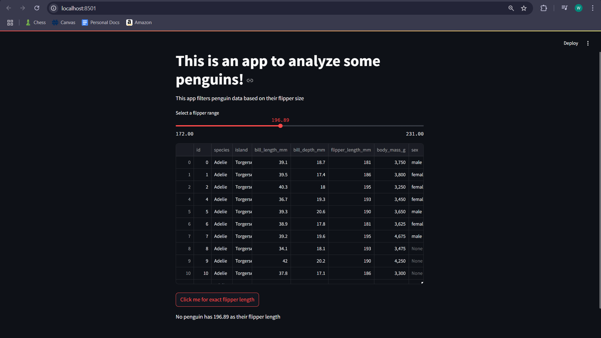

# Steadman-Data Science Portfolio

This Portfolio is a compilation of all the Data Science and Data Analysis projects I have done for academic and self-learning purposes.

## First Streamlit App
- This project demonstrates importing a dataset and interacting with it through a Streamlit app

[Link to Basic Streamlit App](https://github.com/wsteadman/Steadman-Data-Science-Portfolio/blob/main/Basic-streamlit-app/main.py)

### Visual:

## Tidy Data Project
- This project demonstrates taking unclean data, cleaning it, and using it to create basic charts/visualizations

### Visual: 
