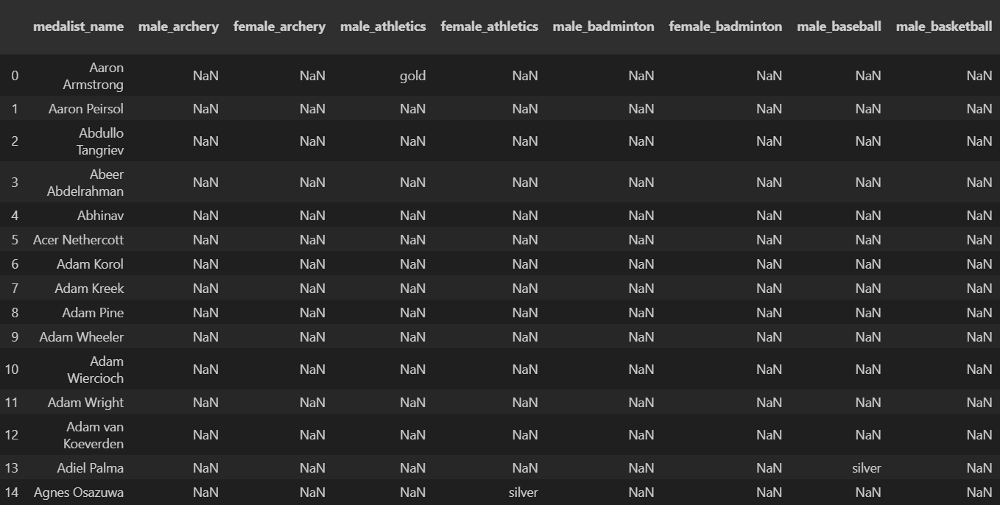
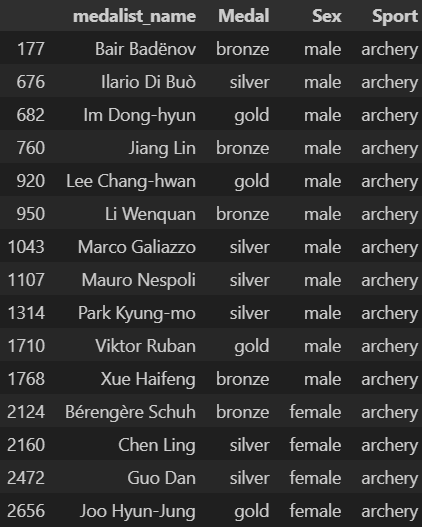
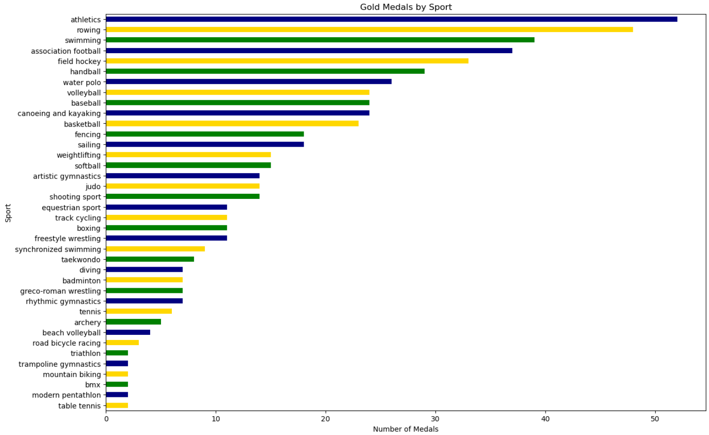
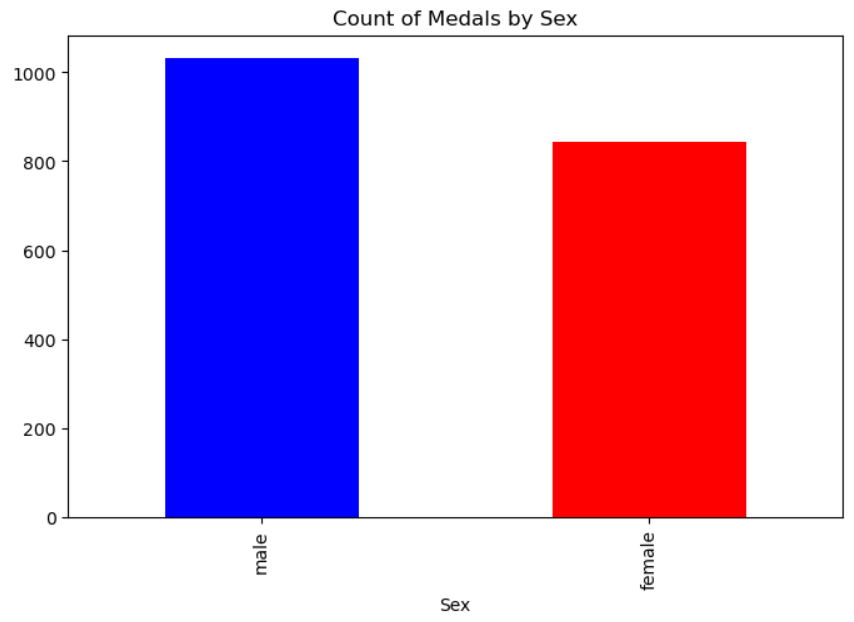
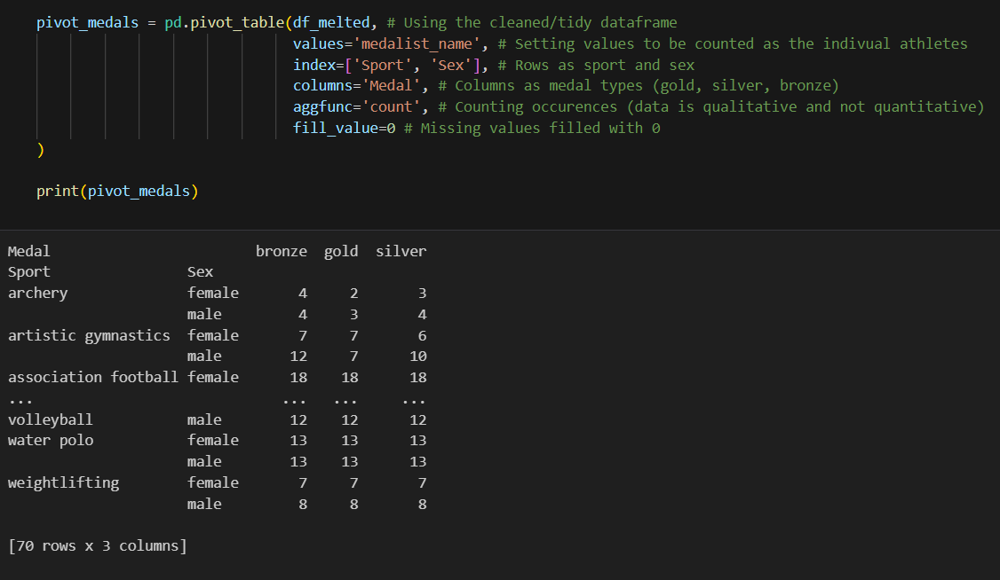

# Project Overview: 
This project is desgined to showcase cleaning & visualizing a flawed dataset in Python! 

[Link to Project](https://github.com/wsteadman/Steadman-Data-Science-Portfolio/blob/main/Tidy%20Data%20Project/Olympians.ipynb)

## Instructions: 
- Pip install pandas 
- Import the 2008 Olympic Medalist dataset
- Run the Jypter notebook cells in order, first reshaping the dataset:
    - Each variable is in its own column
    - Each observation forms its own row
    - Each type of observational unit forms its own table

- Create visualizations by running Jypter notebook cells:
    - barchart showing total numbers of each medal 
    - barchart comparing total number of men's to women's sports 
    - horizontal barchart showing number of medals for each sport
 
- Create a pivot table:
    - counting number of medals by sex and sport

## Dataset Description: 
- Contains 2008 olympic medal winners 
- Sourced from a CSV given by professor 
   - Flawed in that each athlete is cross referenced with every event
 
[link to flawed data](https://github.com/wsteadman/Steadman-Data-Science-Portfolio/blob/main/Tidy%20Data%20Project/olympics_08_medalists.csv)

## References:
[Data_Tidy_Notes_1](https://github.com/wsteadman/Steadman-Data-Science-Portfolio/blob/main/Notes/Week%206/IDS_6_1_FINAL.ipynb)

[Data_Tidy_Notes_2](https://github.com/wsteadman/Steadman-Data-Science-Portfolio/blob/main/Notes/Week%206/IDS_6_2_FINAL.ipynb)

[Pandas_Cheat_Sheet](https://pandas.pydata.org/Pandas_Cheat_Sheet.pdf)

## Visuals:
### Transforming flawed dataframe:
 

### Example Charts:
 

### Pivot Table:
 
